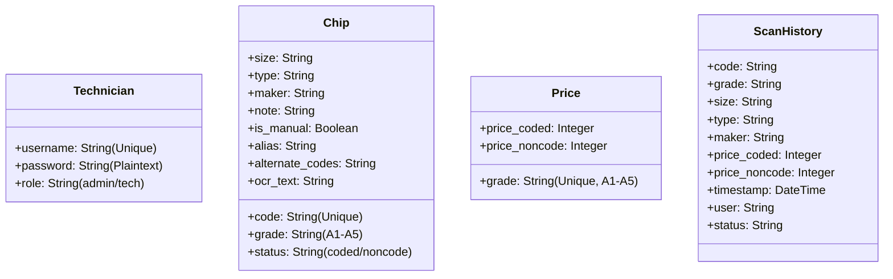

# 📱 ChipScan PH — System Overview

ChipScan PH is a premium, mobile-responsive smartphone storage chip grading and pricing application designed for repair shop technicians and administrators in the Philippines. It combines a client-side real-time OCR engine with a lightweight, robust Django backend to streamline the evaluation, categorization, and pricing of recycled eMMC and UFS memory chips.

---

## 🏗️ Architecture & Technology Stack

The application is structured as a modern monolithic web app optimized for mobile-first user interfaces:

*   **Backend Framework**: Python 3.10+ & Django.
*   **Database**: SQLite (`db.sqlite3`), configured as a persistent local file database.
*   **Frontend**: Vanilla HTML5, CSS3 (responsive design with modern styling, bespoke gradients, custom dark mode optimized for mobile viewports up to `430px`), and Vanilla JavaScript.
*   **OCR Engine**: Client-side **Tesseract.js** (v5) integrated directly in the browser. It processes the camera viewfinder or uploaded gallery images through an HTML Canvas to extract chip codes and perform real-time database matching.

---

## 📊 Database Schema & Models (`scanner/models.py`)

The application's relational schema is modeled around four core entities:

### 1. `Technician`
Tracks user profiles authorized to access the system.
*   `username` (CharField, unique): Unique account identity.
*   `password` (CharField): Handled as plain text for simple repair shop deployments.
*   `role` (CharField): Access roles, offering either `'admin'` (IT Administrator) or `'tech'` (Technician).

### 2. `Chip`
Defines the authoritative database of recognized memory chips.
*   `code` (CharField, unique): The primary chip model code (e.g., `KMRX1000BM`).
*   `grade` (CharField): Grading tier (from `A5` down to `A1`).
*   `size` (CharField): Storage capacity (e.g., `8GB`, `16GB`, `32GB`, `64GB`, `128GB`, `256GB`, `512GB`).
*   `type` (CharField): Specification format (e.g., `eMMC 5.1`, `UFS 3.1`).
*   `maker` (CharField): Semiconductor manufacturer (e.g., `Samsung`, `SK Hynix`, `Toshiba`, `Kioxia`).
*   `note` (TextField): Contextual information or diagnostic reference.
*   `is_manual` (BooleanField): Identifies if the chip was added manually via the web interface.
*   `status` (CharField): Classification status (`coded` or `noncode`).
*   `alias` (CharField): Alternative names/variants.
*   `alternate_codes` (CharField): Additional matching codes.
*   `ocr_text` (TextField): Cached or custom text mapping targets for OCR heuristics.

### 3. `Price`
Stores buying rates per grade.
*   `grade` (CharField, unique): Grading key (`A5`, `A4`, `A3`, `A2`, `A1`).
*   `price_coded` (IntegerField): Value in PHP when categorized as Coded.
*   `price_noncode` (IntegerField): Value in PHP when categorized as Non-Coded.

### 4. `ScanHistory`
An immutable, chronological audit trail of all scan and query actions.
*   `code`, `grade`, `size`, `type`, `maker`: Snapshot metadata of the chip at the time of evaluation.
*   `price_coded`, `price_noncode`: Historical pricing locked at the scan event.
*   `timestamp` (DateTimeField): Auto-recorded transaction log date.
*   `user` (CharField): Username of the technician who performed the scan.
*   `status` (CharField): The active classification status during that specific scan.

---

## 🔌 API Route Architecture (`scanner/urls.py`)

All business logic flows through structured JSON REST endpoints:

| Endpoint | Method | Purpose |
| :--- | :---: | :--- |
| `/` | `GET` | Main Viewport: Serves the single-page application (SPA) shell. |
| `/api/login/` | `POST` | Authenticates a user profile against technician records. |
| `/api/chips/` | `GET` / `POST` | Lists all chip definitions / Registers a new custom chip (with server-side duplicate check). |
| `/api/chips/<str:code>/check/` | `GET` | Performs a real-time, case-insensitive check to retrieve full chip attributes. |
| `/api/chips/<str:code>/delete/` | `POST` | Deletes a custom user-defined chip definition (built-in chips are locked). |
| `/api/prices/` | `GET` / `POST` | Retrieves the pricing rate matrix / Updates and synchronizes grade price ranges. |
| `/api/history/` | `GET` / `POST` | Fetches scan logs (filtered: admins see all; techs see their own) / Records a new scan log. |
| `/api/history/clear/` | `POST` | Clears stored logs (admins clear all; techs clear only their own). |
| `/api/users/` | `GET` / `POST` | Lists registered accounts / Registers a new technician. |
| `/api/users/<str:username>/delete/` | `POST` | Removes a user profile (system blocks deletion of default `admin`). |
| `/api/stats/` | `GET` | Aggregates database metrics: scan volumes, user totals, and coded/noncode chip tallies. |

---

## ⚙️ Core Application Pipelines & Workflows

### 1. The Real-Time OCR Pipeline
*   **Viewfinder Overlay**: A full-view layout features active corner highlights purely for stylistic framing. The scanner captures the **entire camera screen** instead of restricting data processing to a cropped window.
*   **Resolution and Optimization Scaling**: The image is mapped to an internal canvas. If the capture is smaller than a target threshold (`2000px`), it dynamically scales up using a canvas smoothing context. This enhances contrast and line resolution to significantly improve Tesseract OCR recognition accuracy.
*   **Confidence Scoring & Fallback Matching**: Text processed by Tesseract is normalized (stripped of whitespace/special characters). The system searches for exact or alias matches. If no match is found, technicians can manually type standard part numbers to retrieve details from the local DB.

### 2. The Lazy Database Pre-seeder (`scanner/views.py`)
To guarantee standard out-of-the-box operation on empty systems, a pre-seed process triggers on index page load:
*   **Default Accounts**: Registers `admin` (password: `admin123`, role: `admin`) and `tech1` (password: `tech123`, role: `tech`).
*   **Default Pricing Rules**: Populates the 5 tiers with standard values:
    *   `A5`: Coded = 850 PHP, Non-Coded = 600 PHP
    *   `A4`: Coded = 650 PHP, Non-Coded = 450 PHP
    *   `A3`: Coded = 450 PHP, Non-Coded = 300 PHP
    *   `A2`: Coded = 300 PHP, Non-Coded = 200 PHP
    *   `A1`: Coded = 120 PHP, Non-Coded = 80 PHP
*   **Built-in Memory Inventory**: Pre-loads **28 prominent industrial chips** (Samsung eMMC/UFS, SK Hynix eMMC/UFS, and Toshiba/Kioxia eMMC/UFS definitions).

### 3. Role-Based Features
*   **Technician View**:
    *   Access to the camera scanner and gallery upload.
    *   Manual query database tool.
    *   Real-time view of scanned chip results (including model, size, type, manufacturer, grade, pricing classification, and notes).
    *   Personal logged history tracker with individual clear functions.
*   **IT Administrator View**:
    *   Aggregated dashboard displaying diagnostic stats (total scans, tech counts, manual vs. built-in chips, and coded vs. non-coded ratios).
    *   Pricing Rate Editor (real-time price updates for all grades).
    *   User Manager (view, register, and delete accounts).
    *   Global Scan Audit Logs (ability to inspect and clear records across all technicians).

---

## 📱 Mobile Connectivity & Deployment Guide

Since mobile web browsers block camera hardware API calls on non-secured `http://` protocols, the application supports two standard setup patterns:

### 1. Insecure Host Bypass (For Local WiFi Networks)
1. Run Django bound to all local interfaces: `python manage.py runserver 0.0.0.0:8000`.
2. Connect your mobile phone to the same Wi-Fi.
3. Access: `http://<YOUR_COMPUTER_IP>:8000`.
4. **Android Chrome Bypass**: Go to `chrome://flags/#unsafely-treat-insecure-origin-as-secure`, input the IP URL, change the status to **Enabled**, and relaunch.
5. **iOS Safari**: Automatically permits local network camera streaming.

### 2. Secure Tunneling (Recommended for iOS/Safari)
Using tools like **ngrok** to tunnel Django port `8000` to a secure public URL (`https://<random-id>.ngrok-free.app`), satisfying all strict platform security checks without additional browser flag configurations.
